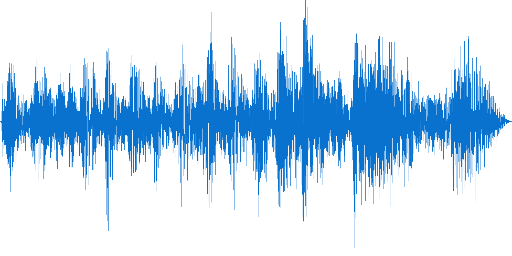

# Creating Audio Waveform Images

 - Author: **Alex Coppen** (acamerondev@protonmail.com)

## Overview
It's relatively easy to display video online in a visual way, simply by capturing screengrab images from a file. For example, to grab a thumbnail every 10 mins using **FFMPEG**, you can simply do `ffmpeg -i movie.avi -vf fps=1/600 thumb-%04d.bmp`. Audio is slightly harder.

The undisputed leaders in this area are **SoundCloud**.


 
## Background
An audio file has either one channel (*mono*, copied left and right) or two channels (*stereo*, separate left and right). A waveform is a graphical representation of the shape and form of a signal: i.e. the magnitude of sound pressure alternation (*amplitude*), plotted against time (*periodicity*).

Silence has an amplitude of 0.

Higher sound pressure means more energy in the sound wave. Increase the sound pressure by 6dB and the energy will be doubled; increase sound pressure by 12dB, and the energy will be quadrupled, and so on.

The *frequency* of a periodic wave is the number of cycles that occur per second. If a signal has a duration of 0.01s, it has a frequency of 100 cycles per second, or 100Hz. Low noises have a less intense frequency cycle, whereas high noises have a very, very frequent cycle. The frequency spectrum runs from 0Hz to over 24,000Hz.


Humans hear best at 2000-5000Hz, as human speech typically spans 100-8000Hz. A telephone is between 2000-5000Hz.

## Dynamic Audio Processing 

Before anything else, if you're looking to do any kind of complex audio manipulation, you'll need **SoX** (Sound eXchange), which is like the FFMEG of audio, so to speak. SoX is essentially a command-line audio workstation for Linux.

- http://sox.sourceforge.net/

```bash
apt-get install sox # nix
brew install sox # Mac
```

SoX can do:

 - Tone/filtering FX (compression, EQ)
 - Production FX (reverb, delay, overdrive etc)
 - Volume FX (gain, loudness etc)
 - Editing/Mastering FX (trim, splice etc)
 - Mixing!
 - Pitch/Tempo FX (bend, stretch etc)
 - Analysis (spectrogram, stats, noise etc)

### Example SoX commands

Combine audio files:

```bash
sox -m first_part.wav second_part.wav whole_part.wav
```

Extract 30s of audio from 55s in:

```bash
sox old.wav new.wav trim 55 30
```

Make the speed twice as fast:

```
sox input.wav output.wav speed 2.0
```

1000Hz low-pass filter:

```bash
sox foo.wav bar.wav lowp 1000.0 
```

Add a wah-wah flange:

``bash
sox old.wav new.wav flanger .5 .5 .5 1 2 -t
```

## Browser/Client Side 

HTML5 is allegedly featuring more complex audio manipulation. For the brave, dive right in.

 - https://developer.mozilla.org/en-US/docs/Web/API/Web_Audio_API
 - http://chimera.labs.oreilly.com/books/1234000001552
 - https://www.html5rocks.com/en/tutorials/webaudio/intro/
 - https://github.com/jeromeetienne/webaudiox

The most developed library out there (at the time of writing) for waveforms in Javascript is **Wavesurfer.js**: 

- https://wavesurfer-js.org/

Example:

```js
var wavesurfer = WaveSurfer.create({
    container: '#waveform',
    waveColor: 'violet',
    progressColor: 'purple'
});

wavesurfer.load('audio.wav');
```

Others to play with:

- https://github.com/michaeldzjap/waveplayer.js/tree/master
- http://www.bbc.co.uk/rd/blog/2013-10-audio-waveforms
- http://justwave.beotiger.com/player.html
- http://www.nexusosc.com/
- https://codecanyon.net/item/zoomsounds-neat-html5-audio-player/4525354
- https://github.com/jakesgordon/javascript-audio-fx
- https://github.com/Theodeus/tuna
- https://github.com/goldfire/howler.js
- https://dashersw.github.io/pedalboard.js/

WAD: "jQuery for your ears":

https://github.com/rserota/wad

## Server-Side Solution

If you're not using pre-built libraries for NPM (which are easiest), you are going to need to send your audio file to an async background process.

### PHP Example

Server-side waveform generation typically involves a few maneuvers:

1. Upload the audio file.
2. Convert to raw Wav PCM.
3. Run it across `wav2png` or `wav2json`.
4. Manipulate the image, or
5. Store the results.

For the easiest way, we're going to be using the magnificent **PHP-FFMPEG** package (https://github.com/PHP-FFMpeg/PHP-FFMpeg).

*NB: both examples assume we have successfully upload an 128kb/44.1Khz MP3 file, and have installed Wav2PNG, ImageMagick, FFMPEG etc.*

```php
$audio = $ffmpeg->open( 'audio.mp3' );
$audio->waveform(640, 120)->save('waveform.png');
```

And then, the much longer way round:

```php
// creates output.wav in the same dir
exec('ffmpeg -i input.mp3 -acodec pcm_s16le -ar 44100 output.wav', $output);

if( file_exists('output.wav') ) {
	
	// create an image in the dir called output.png with transparent BG and darkened wave
    exec('wav2png --foreground-color=333333ff --background-color=00000000 -o output.png output.wav', $output);
    
    if( file_exists('output.png') ) {
	    // fill the image with our chosen color, add text etc
	    $img = Image::make('output.png');
		$img->fill('#2980B9', 900, 140);
		return Response::make($img, 200, array('Content-Type' => 'image/jpeg'));
	}
}

```



The procedure is the same for creating JSON files:

```php
exec('wav2json output.wav --channels left right mid side min max -o result.json', $output);
```

Example result:

```json
{
    "left":[0,0.499969,0.865997,0.999969,0.865997,0.499969,0,0.5,0.866028,0,0.866028,0.5],
    "right":[0,0.499969,0.865997,0.999969,0.865997,0.499969,0,0.5,0.866028,0,0.866028,0.5],
}
```
 
## Resources

### Libraries

- http://sox.sourceforge.net/
- https://github.com/beschulz/wav2png
- https://github.com/beschulz/wav2json

### PHP

 - https://github.com/boyhagemann/Waveform
 - https://github.com/afreiday/php-waveform-png
 - https://alexkirs.github.io/php-waveform-json/
 - http://justwave.beotiger.com/

### NPM

- https://www.npmjs.com/package/wav2png
- https://www.npmjs.com/package/waveform
- https://github.com/andrewrk/node-waveform
- https://github.com/katspaugh/wavesurfer.js/
- https://www.npmjs.com/package/waveform-thumbnail